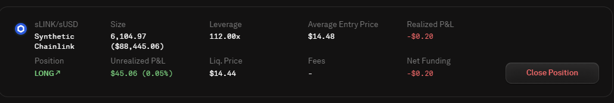

# Getting Started on Optimistic Ethereum

Ethereum mainnet transactions are increasingly becoming expensive. This ongoing crisis birthed layer-2 scaling solutions like Optimism.

Transactions are processed on a Layer-2 network such as Optimism (a network built on top of Ethereum) instead of occurring directly on mainnet Ethereum. The Layer 2 solution submits transactions in groups to the Ethereum mainnet. They are then secured by Ethereums leading security, reducing end-user fees and increasing transaction speed. Optimism states users can save up to 50x in transaction fees.

### Getting Started with Optimistic Ethereum

Optimistic Ethereum provides Near-instant transactions, lower transaction fees, and has the same level of security Ethereum provides.


\* note these upcoming steps assume you already have setup and funded a Web 3.0 Wallet as well as added the Optimistic Ethereum networks required to your wallet. If you need help with setting up a wallet follow our web 3.0 setup guide in [defi-what-is-it-how-do-i-start.md](defi-what-is-it-how-do-i-start.md "mention") and fund it with Ethereum (eth tokens).


### Moving assets to Optimistic Ethereum

Using Optimistic Ethereum requires users to bridge Ether (eth tokens) or other supported ERC-20 tokens to the Optimistic Ethereum Network. Making use of the official [Optimism Gateway](https://gateway.optimism.io) makes this process simple and intuitive.&#x20;

Connect your wallet by selecting "Connect" and select your Web 3 wallet provider

Once users approve connecting their wallet to the Optimism Bridge they can choose from supported assets and an amount they wish to send over to Layer 2 Optimistic ethereum.

Finalize the bridge transaction by selecting "Deposit" and approving the transaction via their connected wallet.

The entire Bridging process will take about 5-10 minutes, once complete you are ready to interact with dApps on Optimistic Ethereum.

#### Withdrawing assets from layer 2?

Withdrawing assets back to Layer 1 or mainnet Ethereum can be accomplished via the same [Optimism Gateway](https://gateway.optimism.io). Instead of selecting "deposit" users instead use the "withdrawal function"&#x20;


There are many bridging solutions available. Note that withdrawals processed via the official optimism bridge are subject to a "7 day challenge period" withdrawn funds will be unavailable until this 7 day period is complete" alternatively users can use other bridges for offramp purposes that don't require this 7 day wait period. Hop exchange shown above is one of those alternatives.


