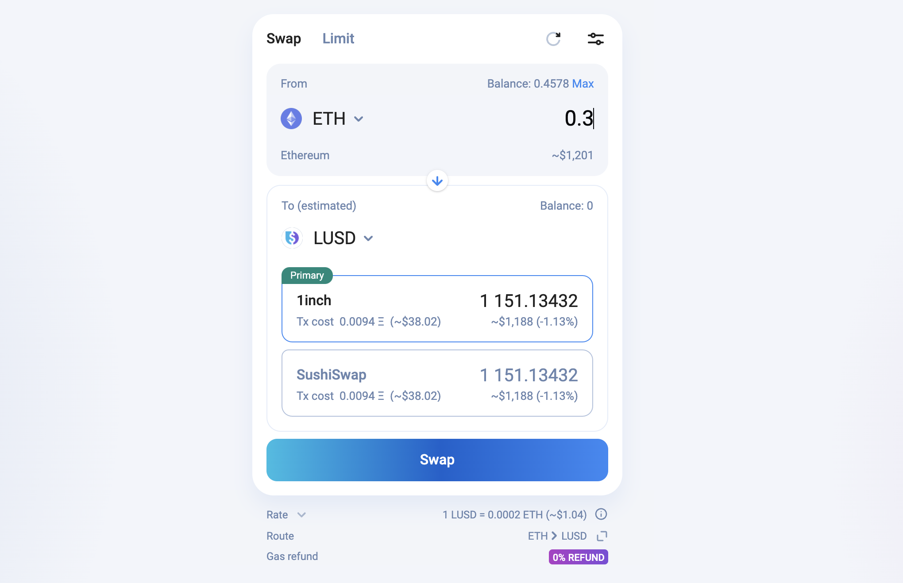
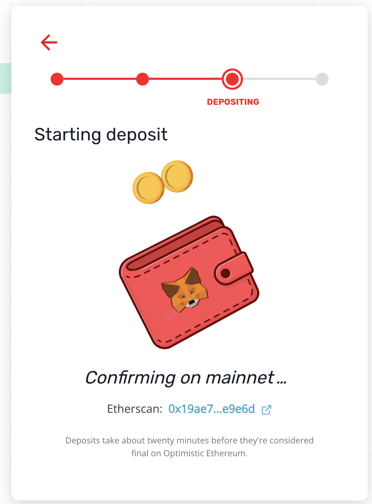
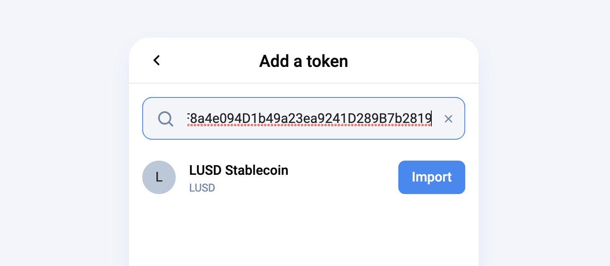
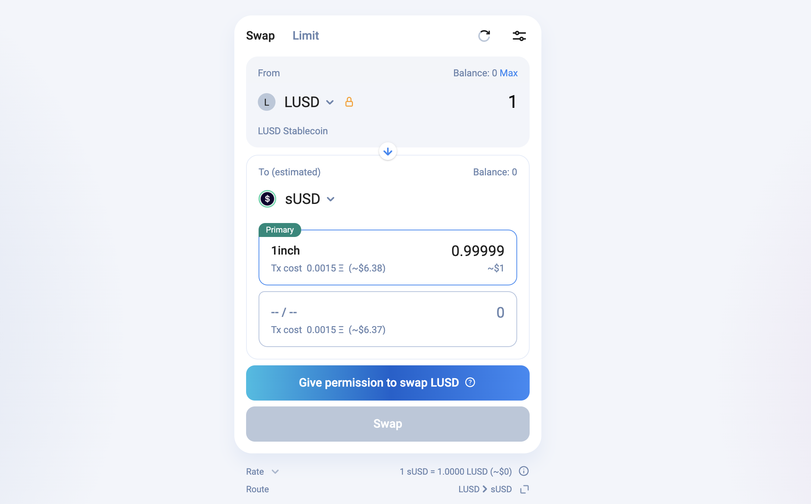

# Get sUSD using the lUSD Wrapper


You can buy sUSD directly with USDC, DAI, or USDT on [https://app.1inch.io/#/10/swap/USDC/sUSD](https://app.1inch.io/#/10/swap/USDC/sUSD) however liquidity may be limited and slippage may be high. Therefore this method allows you to obtain sUSD with limited slippage, but you will spend ±$150 in transaction fees for all the steps


### 1. Get LUSD on Ethereum Mainnet

On Ethereum Mainnet, head over to [https://app.1inch.io/#/1/swap/ETH/LUSD](https://app.1inch.io/#/1/swap/ETH/LUSD) or your DEX of choice and get some LUSD (0x5f98805a4e8be255a32880fdec7f6728c6568ba0)

### 2. Bridge LUSD to L2 (Optimism)

Head over to [https://gateway.optimism.io/](https://gateway.optimism.io) connect your wallet and select LUSD from the token list, the amount to transfer. APPROVE the transaction and then DEPOSIT.

You'll need to wait for up to 20 minutes (normally its much less) until you see your deposit reflected on L2

### 3. Wrap LUSD into sUSD (via 1inch)

Once your LUSD has been deposited into L2 (Optimistic Ethereum) you can go ahead and wrap it into sUSD

1. Make sure your Web 3 Wallet is on the Optimistic Ethereum Network:[How to setup MetaMask guide](https://blog.kwenta.io/installing-metamask/).
2. Head over to [https://app.1inch.io/#/1/swap/LUSD/sUSD](https://app.1inch.io/#/1/swap/LUSD/sUSD)
3. If LUSD is not available to be selected (normal if this is your first time) click on the bottom where it says "Add Token +"\
   
4. ​ Input LUSD L2 address: 0xc40F949F8a4e094D1b49a23ea9241D289B7b2819 and click Import.\
   
5. Now you should be able to select LUSD as From and sUSD as To. Input the amount you want to wrap, approve and Swap!

