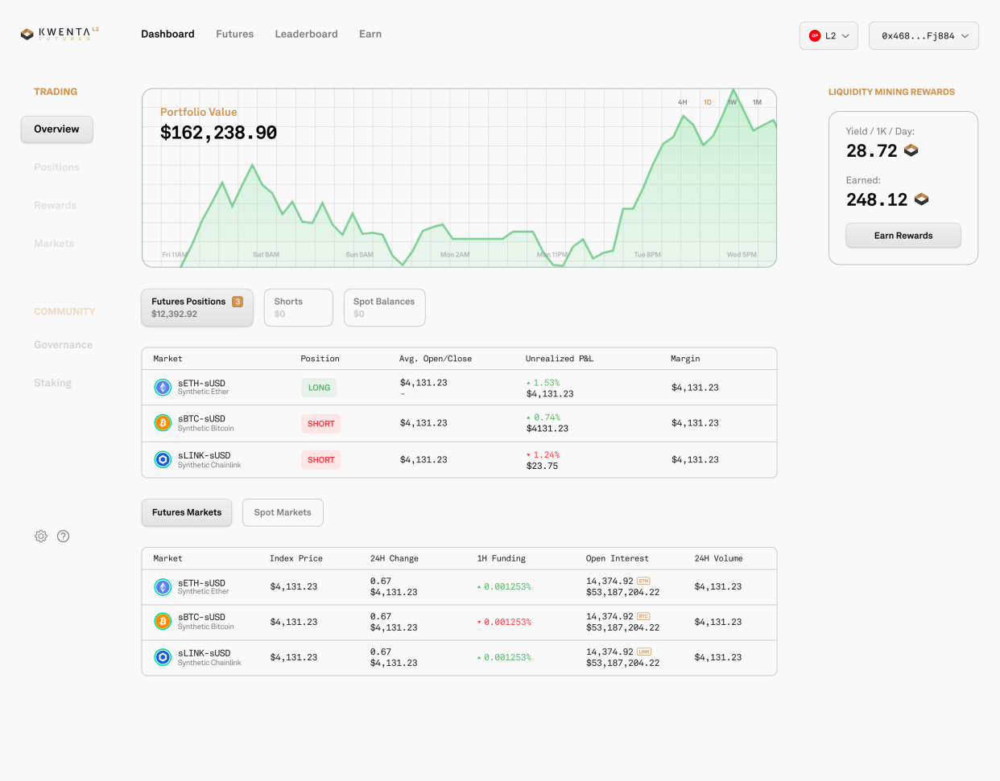

# Futures

Kwenta is developing a decentralized Futures trading platform, launching in March 2022.

The new platform launch is part of the Kwenta [Sovereignty](../tokenomics/sovereignty/) phase and will commence with the [Trading Competition Round 1](../tokenomics/sovereignty/trading-comp-round-1.md) in mid-March 2022.\

Soon, you will find extensive guidelines for our upcoming Futures platform in this place.


For an in-depth overview of the Synthetix Futures implementation, see [SIP-80](https://sips.synthetix.io/sips/sip-80/).

