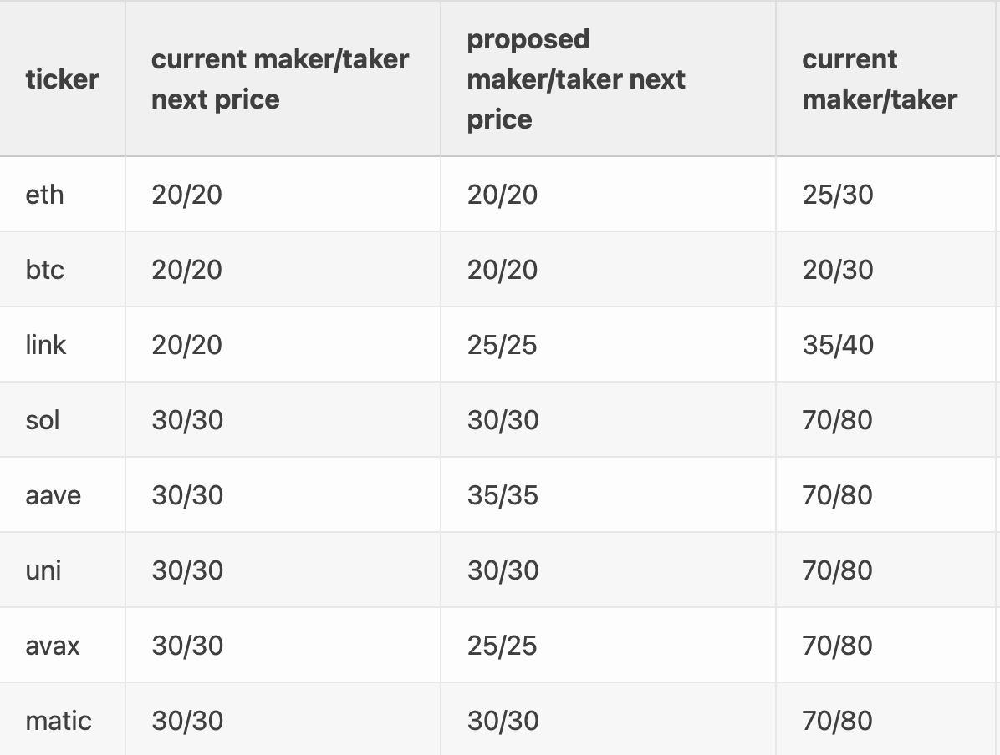

# Next Price


* There is a **Keeper fee** of **5 sUSD**. It is refundable only if the trader cancels the order.
* There is a **Commitment fee** which is equal to the Market Order fees. The difference with lower Next Price Order fees is rebated to the trader once the order executes successfully.
* If for any reason the next price order fails or is canceled, traders forfeit the commitment fee.


### What are next price orders? 

In order to allow funding rate arbitrage to be profitable and for fees on Kwenta to be competitive Kwenta introduced a new order type on Kwenta Futures: **Next Price Orders**. A special exchange fee will be applied to this specific mechanism of non-atomic trades that will use the future (next price) update coming from the oracle.

Due to using the future, unknown price to initiate a trade, this mechanism should thwart traders looking to make risk-free profits by front running (because two prices ahead, instead of one, need to be known to profitably front-run next price). This also gives Kwenta the opportunity to offer a low fee alternative for genuine traders using the platform.

### Keepers 

Keepers can do things like execute limit orders, liquidate under-collateralized loans, and just about anything on-chain autonomously. Automated keeper are set in place to automatically execute next price orders when their conditions are met (at least one oracle price updates has passed). Due to this development, there is no manual intervention needed from traders on Kwenta to execute next price orders.

### How do next price orders work? 

The next price mechanism has 3 functions:

* `submitNextPriceOrder`: Stores an order to be executed at the next price update. Only one order can be stored per asset at a time. A certain amount of fees are deducted from the account on submission: the keeper and the commitment fee. A portion of the commitment fee will be refunded if the order is executed successfully. The keeper fee will be paid to the keeper executing the order. The commitment fee is a proportional fee and is equal to the exchange fee that would be charged for a regular order. The keeper fee is equal to the minimum keeper fee (5 sUSD). The purpose of the commitment fee is to make cancellations cost as much as a regular trade to prevent free optionality, which would mean that the decision to trade is taken when next price is known, which reduces its effectiveness.
* `cancelNextPriceOrder`: a stored order can be canceled by the account itself at any time. It can also be canceled by any other account (e.g. keeper) after the confirmation window passes (the window during which the order can be executed). If an order is canceled, the keeper fee is paid to whoever submitted the cancellation transaction, and the commitment fee is paid to the fee pool.
* `executeNextPriceOrder`: the order can be executed by the keeper during the confirmation window (initially a minimum of 1 oracle update and a maximum of 2 price rounds). If the order executes successfully, the difference between the commitment fee and the next price fe**e** is refunded to the account. The keeper fee is paid to whoever submitted the transaction. If the confirmation window is over, or if the order cannot be executed (reverts), the order will be canceled instead and the keeper fee will be paid to the entity canceling the stale order & the commitment fee is forfeited.


**Example**: A $10,000 long position charges a $20 deposit fee ($5 Keeper plus $15 commit fee). When executing the next price order, only $10 in next price fees are charged, resulting in total fee costs of $15 ($5 keeper plus $10 next price fee). The difference of $5 will be refunded to the trader.


> This mechanism allows lower exchange fees (taker and maker) for such orders, the fees will be set to the following fee schedule below. The dynamic fee will still be added according to the dynamic fee conditions during the execution round (to prevent circumventing the dynamic fee mechanism).

### Closing Positions with next price

Closing a position which has been opened with a next price order still incurs regular exchange fees. In order to save on the regular exchange fee, traders can instead open a new next-price order through the order UI in the opposite direction of the current position.


Closing positions by opening a next price order in the opposite direction of the current position is still **experimental**, and might not close the order fully. To make sure the full order is being closed, it is still recommended to use the Close Position button until a dedicated solution is being added to the UI.


