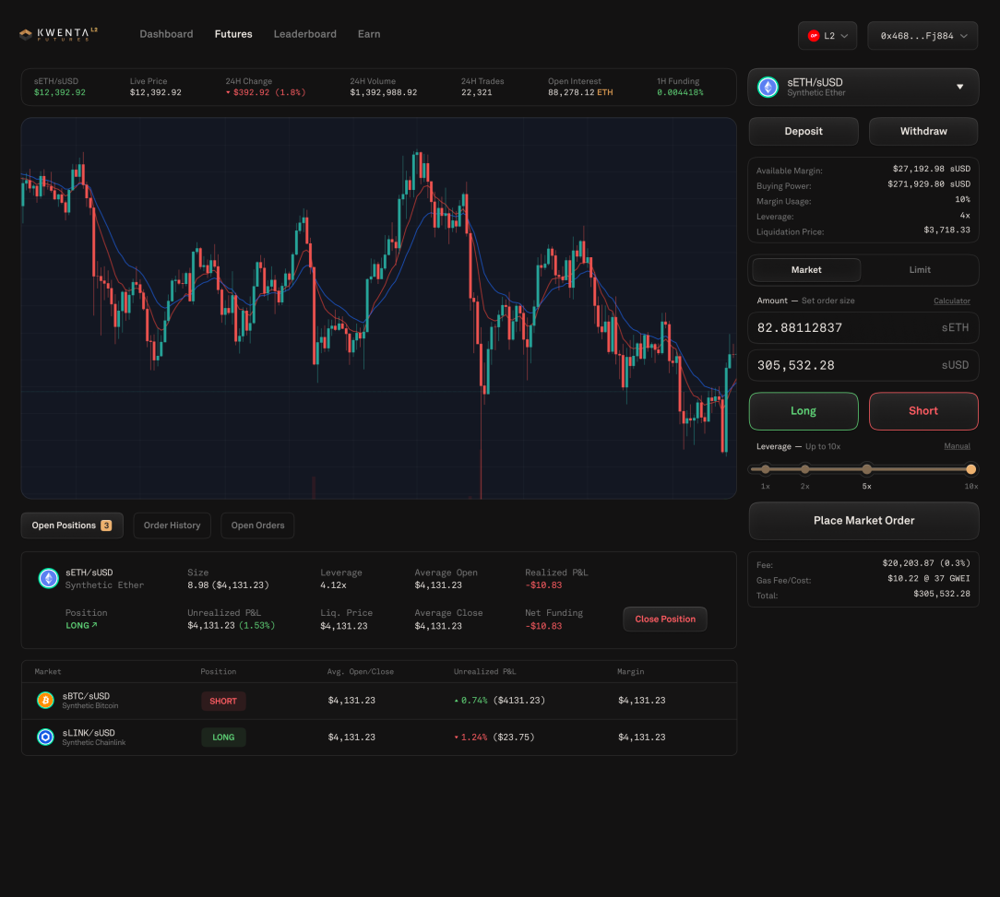

# Kwenta V2

Kwenta is close to launching a complete refresh of the interface. The goal was to recreate the familiar trading experience on popular centralized exchanges while optimizing for the benefits of trading in L2 DeFi. \
\
The new Kwenta V2 UI has been carefully crafted using futures traders’ direct feedback. The entire product suite will be a more familiar and polished experience. Here is a glimpse of what’s to come in March of 2022:

### Futures Dashboard:

 

### Main Kwenta Dashboard

 
