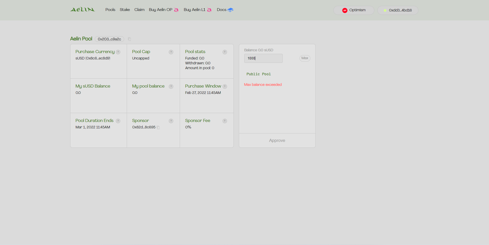

# Join the Pool

For those interested in participating in the Kwenta Aelin raise, you will need:

* Web 3 Wallet see [kwenta-aelin-how-to.md](kwenta-aelin-how-to.md "mention")
* ETH on Layer 2 Optimism [getting-started-on-optimistic-ethereum.md](../../../onboard/how-to-start-using-kwenta/getting-started-on-optimistic-ethereum.md "mention")
* sUSD on Layer 2 Optimism [why-susd.md](../../../onboard/how-to-start-using-kwenta/why-susd.md "mention")

Once you have what you need head over to the [Kwenta Aelin raise pool](https://raise.kwenta.io) to begin.


Make sure you understand and review all the details of the Pool. You'll find a description of each term in the [Getting Started ](kwenta-aelin-how-to.md)section.


**Join the open pool**

Once you have found the Kwenta Pool, review all the details related to the Pool and ask any questions you have in the [Community Discord](https://www.discord.gg/Kwenta). If you are on board with the proposed terms, you can choose the amount of sUSD you want to purchase/contribute to this Pool.\

**Step 1 - Connect your wallet**\
****\
****You can connect your web3 wallet by finding the "Connect" button at the top right corner of the Aelin screen. You'll be prompted to pick your wallet and approve a prompt allowing access to communicate with your wallet.


Confirm you are connected to the correct wallet and on Optimism Layer 2.&#x20;


**Step 2 - Pledge sUSD**\
****\
****In this step once your wallet is connected you can you enter the amount you wish to purchase and select "Purchase" you'll be prompted in your web3 wallet to approve/allow the contract to spend your sUSD, and later approve the contribution.

Once complete (a few seconds) you'll see "My Pool Balance" will reflect your contribution in the Pool dashboard.

**Step 3 - Wait until the Purchase Lock Duration is complete**&#x20;

Now all you have to do is wait until the Purchase Lock Duration (Feb 27th) is complete, then the Kwenta treasuryDAO can create a deal, and contributors have 24 hours to choose to either accept or not accept, partially or in full their token allocation.
