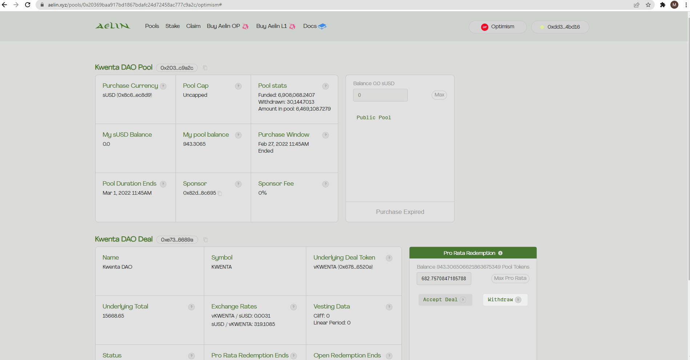
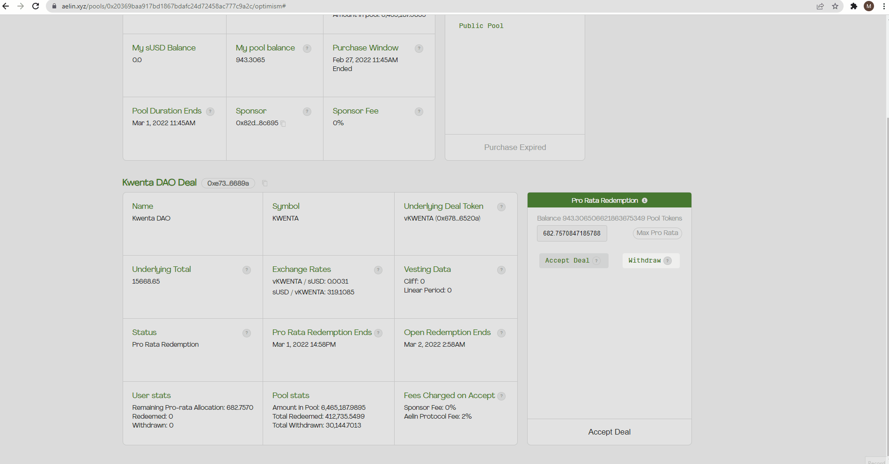

# Claiming Your Allocation

Kwenta Community Raise closes on Sunday Feb 27th at 4:45 PM UTC. Pool Contributors can head back to: [https://aelin.xyz/pools/0x20369baa917bd1867bdafc24d72458ac777c9a2c/optimism](https://aelin.xyz/pools/0x20369baa917bd1867bdafc24d72458ac777c9a2c/optimism)\
to either accept or reject their allocation&#x20;

1. Connect the wallet you used to initially pledge sUSD to the Kwenta Aelin Pool.
2. You'll now see "The Kwenta DAO Deal" section at the bottom of your display, and to the right you'll find a Entry Panel labeled "Pro-RATA REDEMPTION". Here you can either select to accept a portion by entering an amount or accept the max allocation by selecting "Max Pro Rata". 
3. Once you've selected whether to accept or decline the deal and how much you would like to accept you can hit "accept" and submit the transaction.\
   \
   &#x20;
4. Come back when the 48 hour Pro Rata Period is over if you accepted the max allocation, and didn't withdraw any remaining sUSD. There will be a 12 hour Open Redemption period where any tokens that were forfeited by pool contributors will be up for grabs on a first come first serve basis.
5. Once the Open Redemption period is over Mar 2, 2022 7:58AM UTC. Pool Contributors will be able to vest their tokens. When the time comes vKwenta will be exchangeable 1:1 for $KWENTA when it launches.

.png>)
